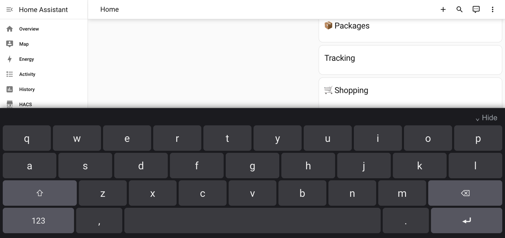

# Lovelace On-Screen Keyboard

> **Status: Beta, under active development.** Deployed and being tested on
> one household kiosk so far — not yet broadly tested across devices/HA
> versions. Interfaces and behavior may still change before a stable 1.0.

A dependency-free on-screen keyboard for Home Assistant dashboards on
touchscreen kiosks (wall tablets, fridge displays, etc.).

## Why not just use an OS-level virtual keyboard?

Tools like `onboard` or `matchbox-keyboard` rely on the browser exposing a
full accessibility tree (via AT-SPI on Linux) so they can detect when a text
field is focused. This has two problems in practice:

- It's a real, constant per-frame rendering cost, paid on every frame
  regardless of whether anyone is typing.
- It's fragile — the [Home Assistant community has been asking about this
  exact problem since 2019](https://community.home-assistant.io/t/virtual-keyboard-for-chrome-in-kiosk-mode-on-raspberry/95975)
  with no reliable resolution; `onboard` and `matchbox-keyboard` are commonly
  reported as simply not working depending on the Chromium version/kiosk setup.

This card sidesteps the whole problem by living in the page itself. It's a
single vanilla-JS file with no external dependencies, watching for standard
`focusin`/`focusout` events (which bubble through shadow DOM boundaries, so
it works with inputs inside other custom cards too). It only renders/does
anything while a text field is actually focused.

## Install

**Via HACS:**
1. HACS → Frontend → ⋮ → Custom repositories
2. Add this repo's URL, category: Dashboard
3. Install, then add the resource if HACS doesn't do it automatically
   (Settings → Dashboards → Resources)

**Manually:**
1. Copy `onscreen-keyboard-card.js` into your `config/www/` folder
2. Settings → Dashboards → Resources → add `/local/onscreen-keyboard-card.js`,
   type: JavaScript Module

## Configuration

None needed. Once added as a resource it activates dashboard-wide,
automatically, on any focusable `<input>`/`<textarea>` on the page.

## Notes

- Layout/sizing was tuned for a 1080×1920 portrait touch panel. If your
  screen is a very different size, the key height/font-size are plain CSS
  constants near the top of the file — adjust to taste.
- No configuration options, no build step, no dependencies by design — this
  solves one specific problem and nothing else.

## License

MIT
